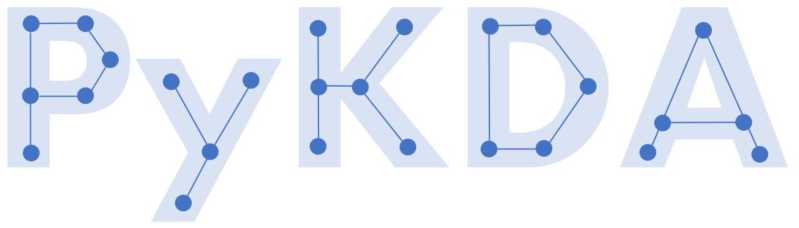

#

Welcome to the documentation of the Python package `pykda` which implements the
Kemeny Decomposition Algorithm (KDA) from [Berkhout and Heidergott (2019)](https://research.vu.nl/ws/portalfiles/portal/104470560/Analysis_of_Markov_influence_graphs.pdf).
This package allows to decompose a Markov chain into clusters of states, 
where states within a cluster are relatively more connected to each other compared
to states outside the cluster. 

KDA uses the Kemeny constant as a connectivity measure.
The Kemeny constant is equal to the expected number of steps it takes to go from
an arbitrary state to a random state drawn according to the stationary distribution
of the Markov chain.

The package also contains Markov chain tooling for the calculations, for more
details about these calculations and the theory, please refer to the book from
[Kemeny and Snell (1976)](https://link-springer-com.vu-nl.idm.oclc.org/book/9780387901923).

### About

This package is an attempt to make the code from [Berkhout and Heidergott (2019)](https://research.vu.nl/ws/portalfiles/portal/104470560/Analysis_of_Markov_influence_graphs.pdf)
more accessible to the public. Also, it serves as a practice project for the
author (Joost Berkhout) to learn about software package development in Python.

`pykda` uses Python 3.10+ and depends on the following packages:

- `numpy`: for numerical linear algebra calculations.
- `tarjan`: to determine strongly connected components in graphs.
- `pyvis`: to visualize the Markov chain and the KDA clusters.

### Contributing

Feel free to contribute! For major changes, please open an issue first
to discuss what you would like to change.
Please make to add tests of the new code where appropriate 
and use pre-commit.

### Acknowledgement
The author would like to thank [Leon Lan](https://github.com/leonlan) for his help
and inspiration. The setup in this package tries to follow that of the package [ALNS](https://github.com/N-Wouda/ALNS).
